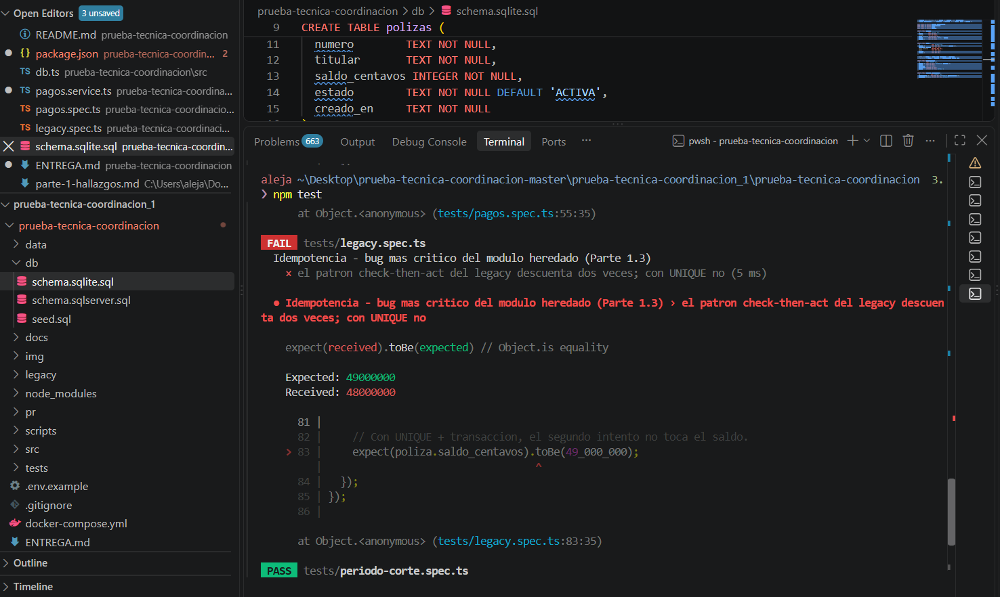
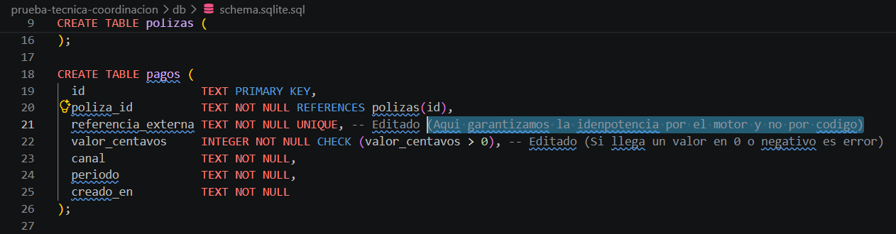
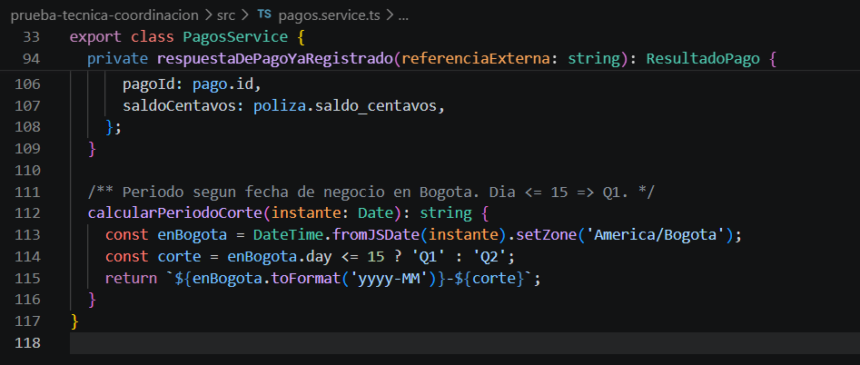
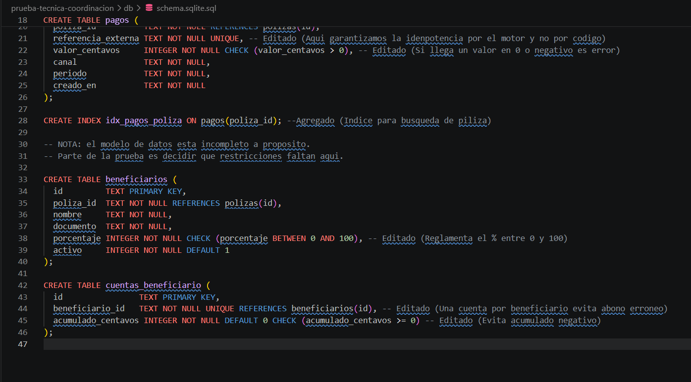

# Prueba técnica — Coordinación de Desarrollo
Entrega

Nombre:**Mario Alejandro Artunduaga Huertas**  
Fecha:**26/08/2026**  
Tiempo aproximado invertido:**4.5 horas**  

---
**Stack usado y cómo se ejecuta:**

Use el esqueleto entregado.

**Qué usé de IA y cómo lo validé:**

Parte 1.  
1. Realizé el barrido del archivo legacy/pagos.service.ts para extraer los problemas presentados en produccion para analizar impacto y posibles soluciones.La validacion se realizo verificando la slineas de codigo indicadas.  
2. Se uso para organizar la tabla. Se valido la tabla con inspeccion visual y revisando la priorizacion segun criticidad de cada caso. 

Parte 2.  
1. Se hizo un barrido de la DB para validar pendientes. Se valido compilacion correcta al momento de los test  
2. Se solicito sugerencia de codigo para solición de documento src/pagos.service.ts. Se valido cumplimiento de criterios punto a punto del ejercicio propuesto.

Parte 3.  
1 Organización de texto sobre decisiones tomadas para cada caso

>

**Qué dejé fuera y por qué:**

Parte
1.3 No ejecute el archivo heredado ya que no es ejecutable en este paso, está excluido en tsconfig, depende de NestJS/TypeORM/SQL Server no instalados, y consulta columnas que ya no existen en el esquema actual. Si se montaba ese entorno costaba más que el ejercicio completo. Las pruebas del siguiente ejercicio (tests/legacy.spec.ts) reproduce el patrón defectuoso sobre una tabla sin la restricción, el saldo baja dos veces, 48M en vez de 49M y luego ejecuta el mismo escenario contra la implementación corregida en src/pagos.service.ts, que sí descuenta una sola vez.
>

---

## Parte 1 — Revisión del módulo heredado
### Hallazgos

| # | Problema | Qué provoca en producción | Cómo lo corrijo | ¿Hoy o backlog? |
|---|---|---|---|---|
| 1 | Idempotencia "verificar-luego-actuar" (líneas 17-23, 42-45) | Doble cobro sistemático: los reintentos paralelos de la pasarela eluden el `SELECT` inicial por concurrencia, y ambas peticiones insertan y descuentan saldo. | Delego la unicidad a la BD con `UNIQUE(referencia_externa)` y ejecuto el `INSERT` primero dentro de una transacción. | **Hoy** |
| 2 | Ausencia de transacciones / `catch` vacío (líneas 33-53) | Pérdida irreversible de fondos: si la dispersión falla, el saldo ya se descontó pero el dinero no llega, y el sistema enmascara el error devolviendo éxito. | Orquesto el flujo en una sola transacción atómica y hago `ROLLBACK` completo ante cualquier excepción. | **Hoy** |
| 3 | Inyección SQL (líneas 18, 26, 37, 43, 69…) | Brecha crítica de seguridad: permite alterar pagos y saldos, y hoy ya falla con datos legítimos (apellidos con comilla simple). | Consultas parametrizadas (`?`) en el 100% de las interacciones con la BD. | **Hoy** |
| 4 | Desfase de zona horaria y periodo (líneas 56-65) | Afecta vigencia de pólizas: con la UTC del servidor, los pagos nocturnos (hora local) se registran al día siguiente y dejan clientes en mora incorrectamente. | Calculo la fecha de negocio forzando `America/Bogota` y estandarizo el mes a dos dígitos. | **Hoy** |
| 5 | Punto flotante en transacciones (líneas 33-34, 77-78) | Descuadres en conciliación: `parseFloat` pierde centavos por redondeo y el valor disperso deja de cuadrar con el pago original. | Aritmética entera (centavos): `Math.floor` y remanente asignado al último beneficiario para cuadre exacto. | **Hoy** |
| 6 | Dispersión sin validación de integridad (líneas 67-83) | Dispersión parcial invisible: no se valida que los porcentajes sumen 100% y los fallos por cuentas inexistentes rompen el ciclo en silencio (por #2). | Valido que los porcentajes sumen 100% y verifico existencia de cuentas antes de iniciar la dispersión. | Backlog · Próx. ciclo |
| 7 | Dispersión a beneficiarios inactivos (línea 69) | Fuga de capital: se dispersa dinero a beneficiarios dados de baja porque falta el filtro de estado. | Añado filtro estricto `activo = 1` en la extracción de beneficiarios. | Backlog · Próx. ciclo |
| 8 | Omisión del estado de la póliza (líneas 26, 29-31) | Recepción de fondos en pólizas muertas: consulta el estado pero no lo valida y acepta pagos sobre pólizas "CANCELADAS". | Validación dura: rechazo la transacción con error de negocio si el estado ≠ "ACTIVA". | Backlog · Próx. ciclo |
| 9 | Permisividad de saldo negativo (líneas 33-37) | Riesgo de fraude/enmascaramiento: nada impide que un pago exceda el saldo y deje la póliza en negativo sin alertas. | Valido el límite de saldo antes de aplicar, o defino por regla de negocio el flujo para excedentes. | Backlog · Próx. ciclo |
| 10 | Respuesta inconsistente ante duplicados (línea 22) | Reintentos infinitos: devolver una carga distinta a la original impide que la pasarela cierre el ciclo. | Estándar de clave de idempotencia: devuelvo exactamente la misma respuesta de la primera transacción exitosa. | Backlog · Reserva |
| 11 | Acoplamiento estricto al motor de BD (`GETDATE()`, línea 44) | Dependencia de infraestructura: impide pruebas locales en SQLite y subordina la lógica al reloj del servidor de BD. | Inyecto la fecha de negocio calculada en Node como parámetro de la consulta. | Backlog · Reserva |
| 12 | Rendimiento: consulta N+1 (líneas 72-75) | Cuellos de botella en cierres masivos: múltiples consultas a cuentas dentro de un bucle degradan el servicio. | Refactorizo a una única consulta con `JOIN` entre beneficiarios y cuentas. | Backlog · Reserva |
| 13 | Evaluación léxica de fechas (líneas 89-90) | Filtros frágiles en informes: la comparación de texto funciona temporalmente pero falla ante cualquier variación de formato. | Tipar/castear la columna a `DATE` y comparar con fechas nativas. | Backlog · Reserva |

### Justificación del corte

> ¿Por qué esos van hoy y los otros no?

Van **hoy** solo los cinco que pueden **mover o perder dinero real de forma irreversible en cada transacción**, sin que nadie se entere: doble cobro (1), fondos que desaparecen mientras el sistema reporta éxito (2), una puerta abierta para alterar pagos y saldos que además *ya está rompiendo* pagos legítimos (3), pólizas que quedan en mora por un desfase horario (4) y descuadres de centavos que impiden conciliar (5). Todos son daño silenciosos, presentes y difíciles de revertir; y cada hora que siguen abiertos genera un pasivo que después hay que rastrear cliente por cliente.

Los demás duelen menos pero son contenibles. Para el **próximo ciclo** se agruparon validaciones de negocio que nos evitan fugas pero requieren definir la regla con producto (100% de porcentajes, beneficiarios inactivos, estado de póliza, saldo negativo): no las quiero improvisar. La **reserva** son mejoras de robustez, portabilidad y rendimiento (idempotencia "de manual", desacople de `GETDATE()`, N+1, tipado de fechas): no sangran dinero hoy y se pueden hacer con calma. Podemos decir: **hoy detengo la hemorragia; el resto es cirugía programada.**

### El que corregí

> Cuál escogiste, dónde está el arreglo y dónde está la prueba que lo demuestra.

Escogí **La primera, la idempotencia del doble cobro**, porque es el defecto de mayor impacto: es el único que pierde dinero en el flujo normal, sin ataque ni fallo de infraestructura. Además se puede demostrar de forma objetiva (el saldo baja dos veces o una), no depende de criterio.

El arreglo cambia el patrón "verificar-luego-actuar" a que la BD decida: agregé una restricción UNIQUE(referencia_externa) sobre la tabla de pagos y, dentro de la transacción, hago el INSERT primero. Si llega un reintento con la misma referencia, la segunda inserción viola la restricción, la atrapo (SQLITE_CONSTRAINT_UNIQUE) y devuelvo la respuesta del pago original en lugar de descontar el saldo otra vez. Así la unicidad la garantiza el motor, no un SELECT que dos hilos pueden pasar a la vez.

- **Dónde está el arreglo:** el UNIQUE(referencia_externa) en db/schema.sqlite.sql (línea 21), la lógica en src/pagos.service.ts: el INSERT dentro de db.transaction y el catch que detecta el duplicado y devuelve la respuesta original (respuestaDePagoYaRegistrado).
- **Dónde está la prueba:** tests/legacy.spec.ts. Primero reproduzco el patrón viejo sobre una tabla sin UNIQUE: hago los dos SELECT antes de insertar, como si llegaran dos reintentos a la vez, y el saldo baja dos veces (48M). Después corro el mismo caso contra mi implementación: llamo registrarPago dos veces con la misma referencia y el saldo baja una sola vez (49M). Que quede una sola fila (COUNT = 1) lo verifica tests/pagos.spec.ts. Uso este montaje porque better-sqlite3 es síncrono: la concurrencia la simulo con el orden de las operaciones, no con hilos reales. Antes del fix la prueba falla con Received: 48000000 (doble descuento); con el UNIQUE en la línea 21 pasa con 49M. Ambas corridas quedan en las evidencias.

---

## Parte 2 — Implementación

### Decisiones

- **Idempotencia:**
  
La garantizo en la base de datos, porque es el único punto donde la concurrencia se resuelve de forma atómica.

Cada pago que llega de la pasarela trae una `referencia_externa` única. Sobre esa columna se definio una restricción `UNIQUE`, y dentro de la transacción hago el `INSERT` del pago **antes** de tocar el saldo. El flujo queda así:

1. `BEGIN` 
2. `INSERT` del pago con su `referencia_externa`.
3. Si el insert tiene éxito → aplico el descuento de saldo, luego `COMMIT`.
4. Si el insert viola la restricción `UNIQUE` → es un duplicado: `ROLLBACK` de este intento y devuelvo la respuesta de la transacción original ya persistida.

  
**Por qué así y no con un `SELECT` previo:**  
El patrón "verificar-luego-actuar" (`SELECT` y después `INSERT`) tiene una ventana de carrera. Dos reintentos paralelos de la pasarela pueden ejecutar el `SELECT` casi al mismo tiempo, ambos ven "no existe", y ambos insertan y descuentan. La restricción `UNIQUE` elimina esa ventana: la atomicidad la garantiza el motor, que serializa las inserciones y rechaza la segunda. Entonces con esto es imposible que dos pagos con la misma referencia coexistan, sin importar cuántos hilos lleguen a la vez.

- **Zona horaria:**
  
El problema era usar la hora UTC del servidor para la fecha de la transaccion: un pago hecho a las 8:00 p. m. hora Colombia cae ya en el día UTC siguiente, y la póliza quedaba registrada un día después de lo real.

Lo resuelvo **calculando la fecha de negocio explícitamente en `America/Bogota`** en el backend, antes de escribir nada, y tambien normalizando el mes a dos dígitos (`01`–`12`) para que el periodo sea consistente. Esa fecha ya calculada se **inyecta como parámetro** en la consulta, en lugar de dejar que la BD la genere con su propio reloj. Así la fecha de vigencia no depende ni de la zona del servidor ni del motor.
  

- **Códigos de estado HTTP:**  

| Caso | Código | Cuerpo |
|---|---|---|
| Pago nuevo procesado correctamente | `201 Created` | Resultado de la transacción (id, saldo). |
| Reintento con `referencia_externa` ya procesada | `200 OK` | La misma respuesta de la primera transacción exitosa (no un error). |
| Regla de negocio incumplida (póliza no ACTIVA) ó datos invalidos | `422 Unprocessable Entity` | Código y mensaje de negocio. |
| Fallo inesperado tras `ROLLBACK` | `500 Internal Server Error` | Error genérico; nada quedó a medias gracias a la transacción. |

El punto clave es el **reintento duplicado → `200`, no `409`**. Devolver un error haría que la pasarela reintentara indefinidamente; devolver la respuesta original idéntica le permite cerrar el ciclo. El `409 Conflict` se puede usar para un caso contradictorio (misma referencia, distinto monto), no para el reintento normal.

- **Cambios al esquema:**

Sí, édité `db/schema.sqlite.sql`. Agregué 1 linea: (28) y modifiqué 5: (21, 22, 38, 44 y 45):

   

--- 

## Parte 3 — Decisión y coordinación (50%)

## 3A. Nota de decisión técnica (20%)

Qué hago y en qué orden

Lo primero que decido hacer es paralelizar y lo divido de la siguiente manera en los sprints:

- **Sprint 1  Construir la paralelización.**  
Los dos ingenieros van a trabajan juntos sobre la misma pieza: uno es el encargado de construir, el otro apoya pero tambien revisa el desarrollo. No los separo en frentes distintos porque con un equipo de dos frentes de trabajo, dividir produce dos cosas a medias y no tenemos apoyo si uno falta.

El trabajo no es solo partir los 50.000 documentos en rangos, eso nos toma tres o cuatro días. Lo que consume el sprint es el manejo de fallos parciales: qué pasa cuando un worker se cae a mitad del proceso. Sin eso estaría paralelizando un job que se sigue cayendo, y tenemos la experiencia que ya falló dos veces este mes. Al cierre del sprint 1 queda desplegado en producción.

Mientras construimos esta solucion, instrumentamos: medimos el tiempo de cada worker y probamos con 2, 4 y 8. Donde la curva de eficiencia deje de mejorar está el límite serial del proceso. No estamos metiendo un sprint extra para perfilar; es el mismo trabajo, midiendo.

- **Sprint 2  Medir en producción.**  
El día 15 es el corte de evaluación, con cinco corridas nocturnas acumuladas. La primera semana ajustamos el número de workers según lo que muestre la curva de eficiencia del sprint 1, y se afina el manejo de fallos con los casos reales que aparezcan, estos siempre son distintos a los previstos en pruebas.

La segunda semana, con la medición en mano, se prepara la caché: medimos qué porcentaje de documentos cambia entre cortes y definimos la estrategia de invalidación. Ese dato es el que decide si la caché vale la pena. Si resulta que el 70% de los documentos cambia cada noche, la caché no sirve y hay que replantear el sprint 3 antes de empezarlo.

- **Sprint 3  Caché.**
Si el sprint 2 mostró que la paralelización alcanzó y los documentos son estables, se implementa la caché con invalidación por hash de contenido más versión de reglas, y se agrega un muestreo del 1% revalidado en fresco cada noche para detectar divergencias.

Si mostró un límite serial, este sprint se dedica a identificarlo y atacarlo. Cachear no arregla un cuello serial, y arrancarlo sabiendo eso sería gastar el último sprint disponible.

En cualquiera de los dos casos dejo la última semana como margen. Un plan de tres sprints lleno al 100% con dos ingenieros es un plan que no cierra.  

Qué descarté y por qué. 

El modelo más pequeño. Es la única opción que paga un problema de capacidad con moneda de calidad. En validación documental de seguros, perder precisión tiene dos costos: documentos malos aprobados, que es exposición en siniestros y hallazgo regulatorio; y documentos buenos rechazados, que generan retrabajo manual. Ese segundo costo puede consumir más horas de operación de las que ahorra el job.

Lo reconsideraría solo si la medición muestra que la inferencia domina el tiempo y una evaluación sobre nuestra distribución real de documentos demuestra que la precisión se sostiene. No lo descarto por principio, lo descarto como primer movimiento.

Por qué la caché va de segunda y no de primera. La paralelización no cambia ni un resultado de validación. La caché sí puede: si se invalida mal, se valida contra una versión vencida de un documento. En un sistema con exposición regulatoria, primero va lo que no puede dañar la calidad del dato; lo que sí puede, va cuando ya hay medición.

Cómo sé a los 15 días si funcionó?

Métrica principal: Usamos los documentos procesados por hora.

Hoy tenemos: 8.333 doc/hora (50.000 en 6 horas)
La meta: 14.300 doc/hora — equivale a terminar en 3,5 horas

Uso la tasa y no el tiempo total porque sobrevive a los cambios de volumen: si el próximo mes son 60.000 documentos, el tiempo sube pero la tasa sigue siendo comparable.

El umbral queda fijo en 3.5 para que tengamos margen de crecimiento al momento que crezca el volumen, por esto no lo dejamos ajustado en 5 horas

Segunda métrica: cero fallos de ejecución en las corridas del periodo, contra los dos de este mes.

Qué hago con cada resultado:

Bajo 3,5h y sin fallos → funcionó. Sprint 3 iniciamos caché por margen adicional.
Entre 3,5h y 5h → funcionó parcialmente. Sprint 3 va a caché, ahora con estos datos.
Sobre 5h → la paralelización topó contra un límite serial. Sprint 3 se dedica a identificarlo, no a cachear: la caché no arregla un cuello serial.

Con cinco corridas tenemos señal de tendencia, no una prueba estadística. Si el resultado en esa parte queda en el límite, extiendo la medición al cierre del sprint 2 antes de comprometer el sprint 3.

Riesgo principal y plan B  

El riesgo es que la paralelización tope contra un límite que no se resuelve agregando workers: una fracción serial del proceso, un límite de peticiones en la API del modelo, o contención en la base de datos. En ese escenario paso dos sprints y el job sigue sin caber en la ventana.

Es el riesgo que asumo por no dedicar tiempo a perfilar antes. Lo mitigo instrumentando durante la construcción, para que al día 15 sepa no solo cuánto mejoró sino qué lo está frenando.

Plan B: la caché, adelantada al sprint 3 con prioridad completa. Reduce trabajo en lugar de agregar capacidad, así que no depende del límite que haya frenado a los workers. La invalidación va por hash del contenido más versión del conjunto de reglas — sin esa segunda parte, un cambio de reglas dejaría miles de validaciones viejas dadas por buenas.

## 3B. Review de un PR (20%)  

Hola pipe, ya le di una revisada a tu codigo. El endpoint resuelve bien lo que pidió sales y la estructura de la respuesta está ok. El filtro por activo está bien pensado, solo te falta el control de permisos.  
Tengo algunos bloqueantes y otros que si te los dejo solo de sugerencia:  

Resumiendo son dos temas solamente: parametrizar las consultas y no exponer datos personales. Los otros son validaciones cortas.

Bloquean el merge

1. Inyección SQL en las cuatro consultas. El id se pega directo al texto del SQL. Alguien puede mandar algo que borre o altere datos. Y ya está fallando hoy sin atacante: un apellido con apóstrofe (O'Neil) rompe la consulta. Eso nos representa un hallazgo de auditoría por PCI DSS. Recuerda que para arreglar eso es usar consultas parametrizadas: WHERE id = ? pasando el valor aparte, en vez de pegarlo en el texto. Así el motor lo trata siempre como dato y nunca como código.

2. Devuelve la cédula al portal. El detalle incluye documento de cada beneficiario. Y SELECT * sobre polizas entrega todas las columnas sin filtrar. Ahi tenemos riesgo de Habeas Data. Debe devolver solo los campos que el portal necesita.

3. Revienta si un beneficiario no tiene cuenta. cuenta[0].acumulado asume que la fila existe. Si no, error 500.

4. Revienta si la póliza no existe. poliza[0] sin verificar → 500 en vez de 404.

5. incluirInactivos sin control de permisos. Cualquiera puede agregar
?incluirInactivos=true a la URL y ver beneficiarios dados de baja.
No hay validación de quién puede hacerlo.

Sugerencias, no bloqueantes:  

Sumar con SUM() en SQL en vez del bucle en JavaScript
Resolver el N+1: hoy hace una consulta por cada beneficiario; un JOIN lo resuelve en una
Validar incluirInactivos como booleano en vez de comparar el texto 'true'
Revisar el nombre del campo: usa p.valor, pero el esquema dice valor_centavos

Haz las correciones si necesitas ayuda recuerda que tienes como apoyo a Juan (Ing Sr.) y Esteban (Ing Sr.), si estan full yo tengo mañana espacio en calendar de 11-12 agendame y revisamos para montar eso de una. 

## 3C. Priorización (10%)

Yo, el lunes. Arranco por el bug de pagos duplicados, lo primero que hago es pedir los datos para dimensionarlo: cuántos pagos, desde cuándo, cuánto dinero. Sin ese dato no puedo tomar una decisión, puede ser 10 casos o mil, y la respuesta es distinta. En paralelo, reviso agenda disponible y programo un 1:1 que se repita semanal mismo dia misma hora con el ingeniero de los tres sprints. Eso no no lo delego y no puede seguir pasando: si lleva tres sprints así y nadie ha hablado con él, el problema está en la gestión, no en el desempeño.

Delegaría: El reporte del viernes, con alcance recortado y acordado con el cliente antes de comprometerlo. Con la evidencia de trazabilidad para auditoría: eso es extracción de datos, no requiere criterio de arquitectura, y hay dos semanas, entonces con eso vamos bien.

Aplazaría: La deuda técnica del módulo de pagos, al siguiente sprint, pero eso sí atada al arreglo del bug: porque es el mismo módulo y tocarlo dos veces cuesta más riesgo que hacerlo de una.

Digo que no. La migración a PostgreSQL. Lleva meses sin decidirse pero tampoco se puede seguir postergando, arrancarla en la semana del incendio es una mala decisión. Lo que sí hago es agendar la decisión con fecha a 15 días; pero no la ejecuto ahora.

